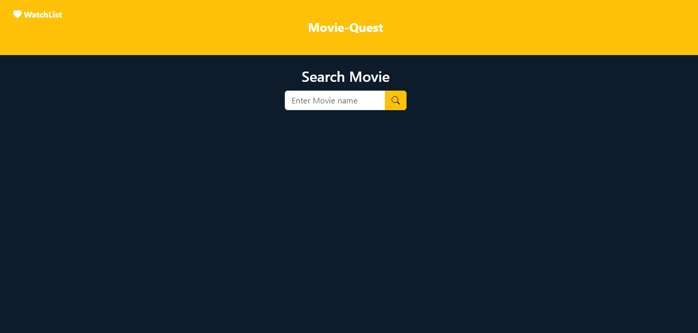
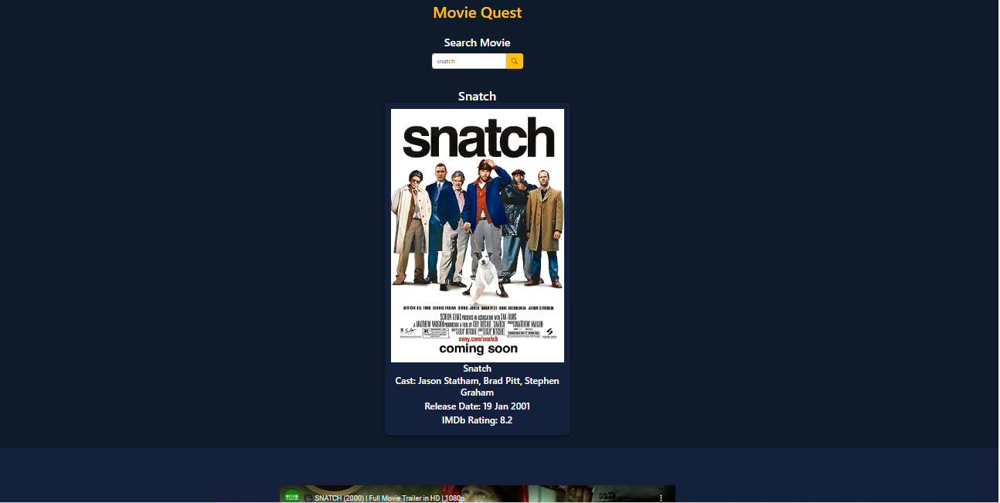

# Movies Web Application

## Description

We as the Team are excited to introduce you to Movie-Quest. With Movie-Quest users can easily search for the movie that they are interested to know more information about, such as the Casts, Release dates, The most recent rating and the ability to watch the trailer all in one place.

But that is not all! We added a personal touch by allowing users to save their favourite movies by checking their watchlist for easy access.

## Table of Contents 

- [Usage](#usage)
- [Installation](#installation)
- [Collaborators](#collaborators)
- [Technologies](#technologies)
- [APIs](#apis)
- [License](#license)

## Usage

#### Access the application on: - 

[Link to deployed page](https://rootgeorge17.github.io/Movie-Quest/)

#### The following images show the application's appearance and functionality:

## Installation

#### Clone repository using SSH:
    - Click on the "Code" button and select "SSH"
    - Copy the SSH URL provided
    - In your terminal, navigate to the directory where you want to clone the repository
    - Run the command: git clone <SSH_URL> : replacing <SSH_URL> with the copied SSH URL.

#### Clone repository using HTTPS:
    - Click on the "Code" button and select "HTTPS"
    - Copy the HTTPS URL provided
    - In your terminal, navigate to the directory where you want to clone the repository
    - Run the command: git clone <HTTPS_URL> : replacing <HTTPS_URL> with the copied HTTPS URL.

## Collaborators 
This project was made possible by the following contributors:

- Benson, Rosemary [Github Link](https://github.com/RoseBenson)
- Djouama, Mohamed [Github Link](https://github.com/Medj41)
- Khail, Said [Github Link](https://github.com/SKhail)
- Sopov, George [Github Link](https://github.com/RootGeorge17)
- Yildiz, Yusuf sercan [Github Link](https://github.com/yildizsrcn)

## Technologies 

- HTML
- CSS
- Javascript
- Bootstrap
- jQuery

## APIs 

- [Youtube API](https://developers.google.com/youtube/v3/docs)
- [OMDb API](https://www.omdbapi.com/)

## License

