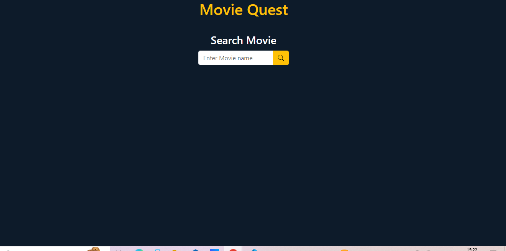

# Movies Web Application

## Description

-

## Table of Contents 

- [Usage](#usage)
- [Installation](#installation)
- [Collaborators](#collaborators)
- [Technologies](#technologies)
- [License](#license)

## Usage

#### Access the application on: - 

[Link to deployed page](https://rootgeorge17.github.io/Movie-Quest/)

#### The following images show the application's appearance and functionality:

## Installation

#### Clone repository using SSH:
    - Click on the "Code" button and select "SSH"
    - Copy the SSH URL provided
    - In your terminal, navigate to the directory where you want to clone the repository
    - Run the command: git clone <SSH_URL> : replacing <SSH_URL> with the copied SSH URL.

#### Clone repository using HTTPS:
    - Click on the "Code" button and select "HTTPS"
    - Copy the HTTPS URL provided
    - In your terminal, navigate to the directory where you want to clone the repository
    - Run the command: git clone <HTTPS_URL> : replacing <HTTPS_URL> with the copied HTTPS URL.

## Collaborators 
This project was made possible by the following contributors:

- Benson, Rosemary [Github Link](https://github.com/RoseBenson)
- Djouama, Mohamed [Github Link](https://github.com/Medj41)
- Khail, Said [Github Link](https://github.com/SKhail)
- Sopov, George [Github Link](https://github.com/RootGeorge17)
- Yildiz, Yusuf sercan [Github Link](https://github.com/yildizsrcn)

## Technologies 

## License

